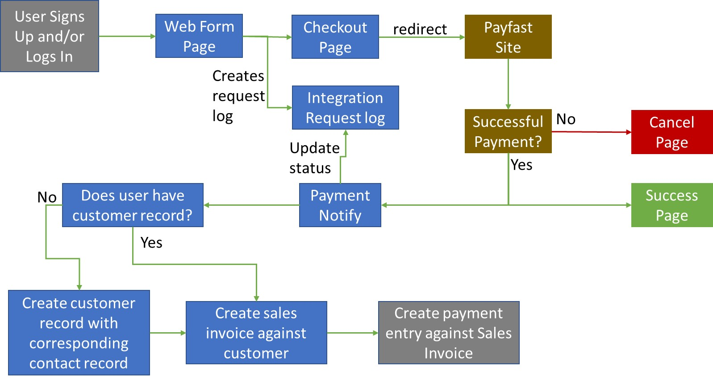
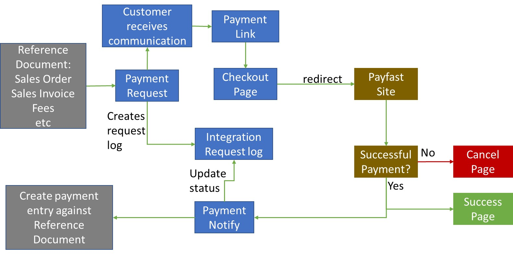
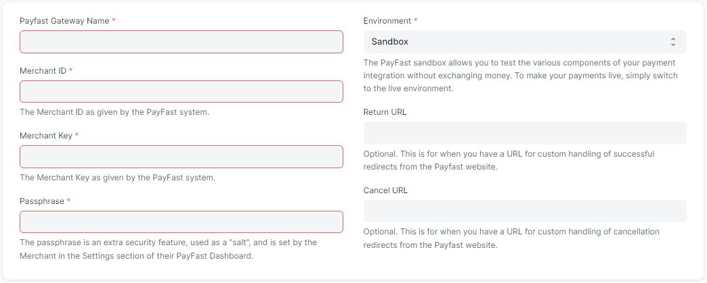
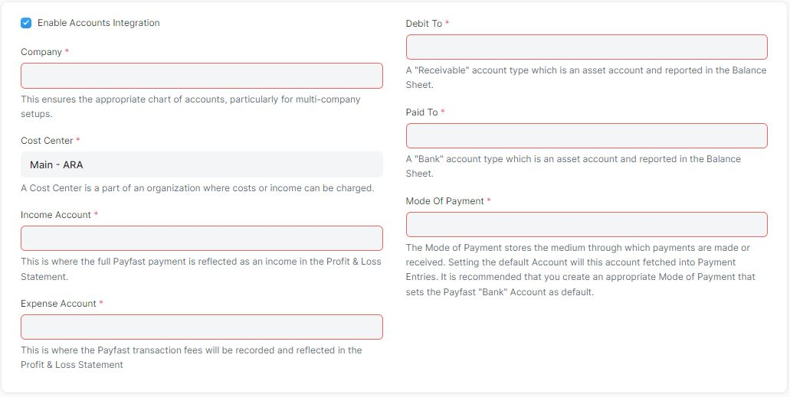

## Payment Gateway Payfast

Payfast Payment Gateway Intergration App for Frappe and ERPNext.

> Disclaimer: This app is NOT an official app of Payfast. Development of the app was guided by the Payfast Custom Integration documentation and the ERPNext process flows. It is your responsibility to review and ensure your process flows and security standards are met. The author will not be held reponsible for any loss as stipulated in the MIT License.

Supported Frappe & ERPNext versions: version-13

Payfast Integration documentation: https://developers.payfast.co.za/docs

Supported currencies = ZAR (South African Rand)

Supported process flows: Web forms and payment requests.

### Web Form process flow

### Payment Request process flow

### Doctype description

Doctype: Payfast Settings

The first section is necessary to ensure successful integration with Payfast
Requirement: A merchant account with Payfast.

The second optional section is necessary to ensure successful integration with ERPNext Accounts module
Requirement: ERPNext app installed

#### License

MIT
